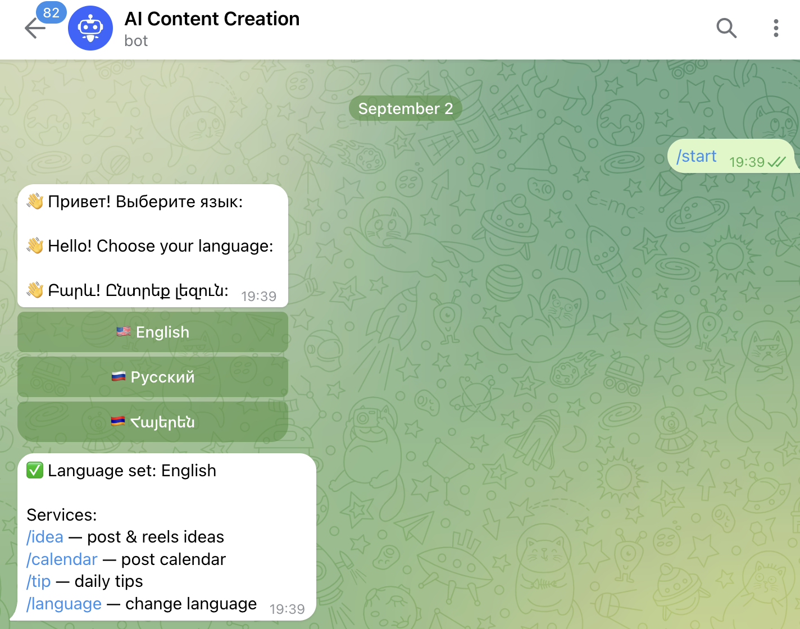
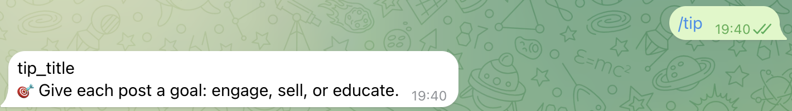
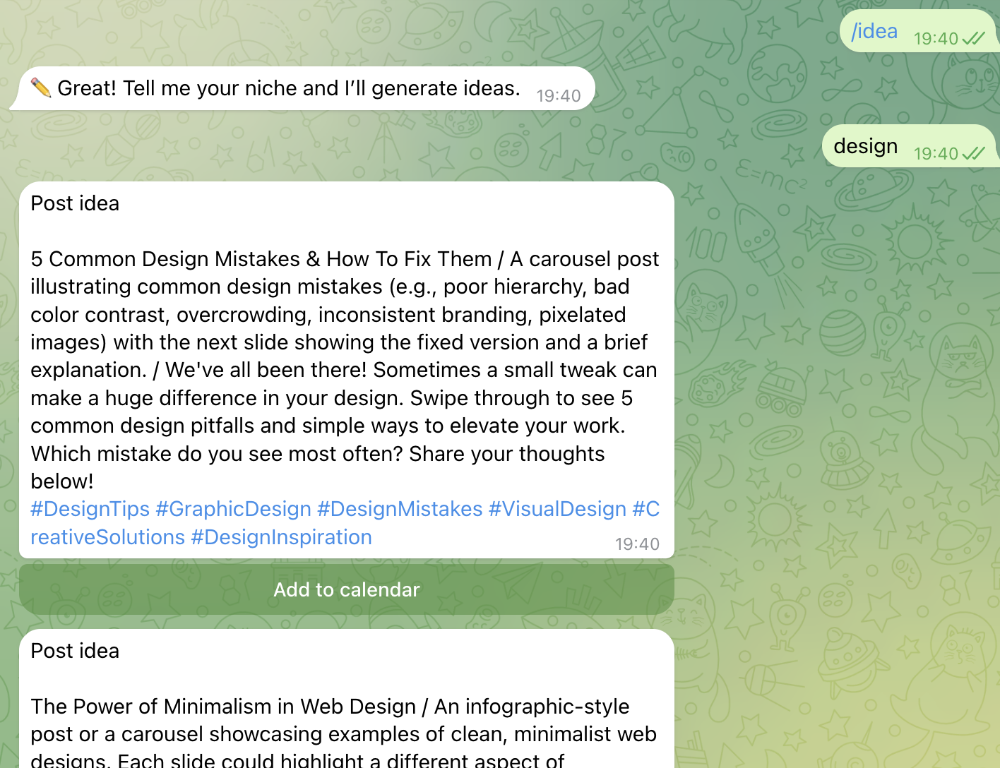
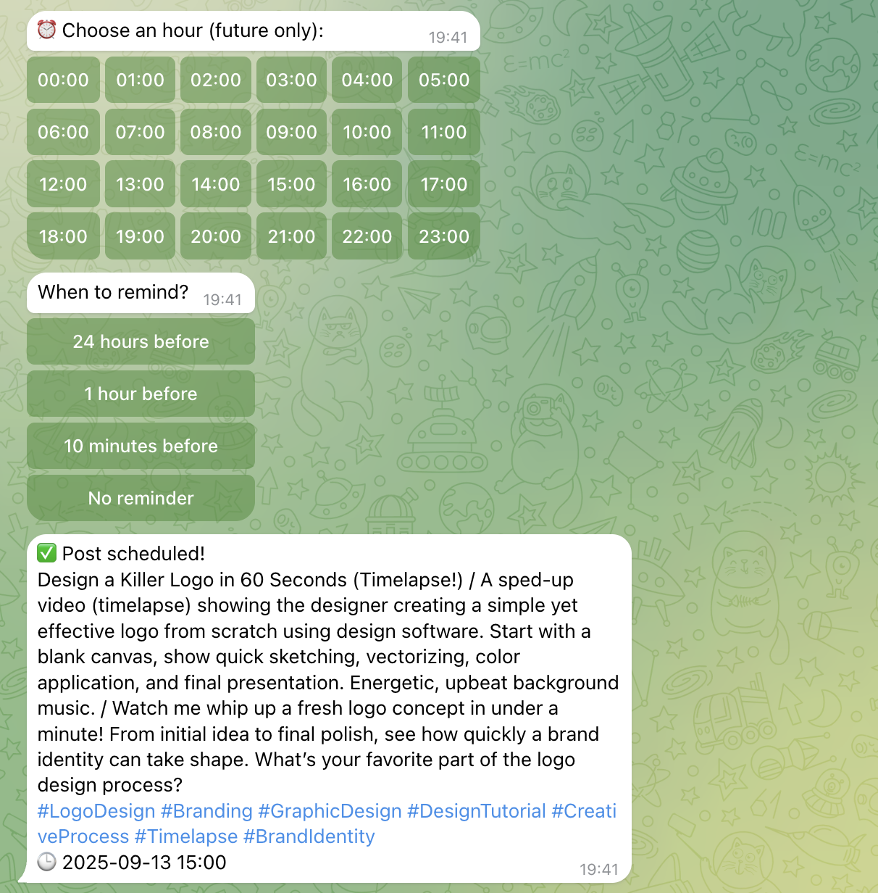

# AiContentGeneration Telegram Bot

[](https://www.python.org/)
[](LICENSE)
[](https://github.com/lyova0/AiContetntGeneration/stargazers)
[](https://github.com/lyova0/AiContetntGeneration/network)

---

## 📌 Overview

**AiContentGeneration** Telegram bot-ը ստեղծված է **social media content** ավտոմատ գեներացնելու համար՝ օգտագործելով **AI տեխնոլոգիաներ**:  
Օգտակար է բլոգերների, սոցիալական մեդիա մենեջերների և բիզնեսների համար:

**Core Features:**

| Feature | Description |
|---------|-------------|
| AI Content Generation | Ստեղծում է posts & reels ըստ niche |
| Gemini AI Integration | Օգտագործում է Google Gemini կամ նման AI մոդելներ |
| Calendar Scheduling | Պլանավորում և հիշեցումներ |
| Multi-language | Հայերեն, Ռուսերեն, Անգլերեն |
| Free Limit | 5 free requests/day per user |

---

## 🛠️ Dependencies

Install required packages:

```bash
pip install aiogram python-dotenv google-genai

```

## Լրացուցիչ գրադարաններ

sqlite3 – տվյալների բազա

uuid – եզակի id-ների ստեղծում

datetime – ժամանակի հետ աշխատելու համար

asyncio – ասինխրոն գործընթացների համար

re – տեքստի վերլուծություն

## 🚀 Installation & Usage

Կլոնավորեք ռեպոզիտորիան
```bash
git clone https://github.com/lyova0/AiContetntGeneration.git
cd AiContetntGeneration
```

## 💡 AI Content Generation (Gemini)
Ստեղծում ենք նոր գաղափարներ / posts / reels
```python
async def generate_ideas(uid, niche):
    lang = user_language.get(uid, "ru")
    human = {"ru": "Русский", "en": "English", "am": "Armenian"}[lang]
    
    prompt = (
        f"Язык ответа: {human}. Ты эксперт по маркетингу и контенту.\n"
        "Сгенерируй 3 идеи для постов и 2 идеи для рилсов для ниши ниже.\n"
        "Строго пометь идеи токенами на отдельных строках: /post1, /post2, /post3, /reel1, /reel2.\n"
        f"Ниша: {niche}"
    )

    answer = await generate_with_retry(prompt)  # Отправляем запрос в Gemini
    # Բաժանում ենք նամակը առանձին մտքերի
    parts = re.split(r'(/post\d+|/reel\d+)', answer)
    for i in range(1, len(parts), 2):
        tag = parts[i].strip()
        text = parts[i+1].strip()
        token = str(uuid.uuid4())
        pending_post_calendar[token] = {"user_id": uid, "text": text}
        await bot.send_message(uid, f"{tag}\n\n{text}")  # նամակների ուղղարկումը
```

## 💡💾 Ստեղծված կոնտենտի պահպանում տվյալների բազայում
Օրացույցում պլանավորել և պահպանել
```python
cursor.execute(
    "INSERT INTO posts (user_id, post_text, publish_datetime, sent, reminded, reminder_offset) "
    "VALUES (?, ?, ?, ?, ?, ?)",
    (uid, text, publish_dt.strftime("%Y-%m-%d %H:%M"), 0, 0, minutes)
)
conn.commit()
```

## 📩 Նամակների ուղարկում օգտագործողինմ
Telegram-ին ուղարկում ենք ստեղծված պոստերը / ռիլսերը
```python
await bot.send_message(
    uid,
    f"{get_translation('post_label', lang)}\n\n{text}",
    reply_markup=add_to_calendar_kb(token, uid)  # Inline կոճակ՝ ավելացնելու օրացույցում
)
```

## 📩 Նամակների ուղարկում օգտագործողինմ
Telegram-ին ուղարկում ենք ստեղծված պոստերը / ռիլսերը
```python
await bot.send_message(
    uid,
    f"{get_translation('post_label', lang)}\n\n{text}",
    reply_markup=add_to_calendar_kb(token, uid)  # Inline կոճակ՝ ավելացնելու օրացույցում
)
```

## 🖼 Նկարներ աշխատանքից

<p float="left">
  
  
  
</p>

<p float="left">
  
  
  
</p>
